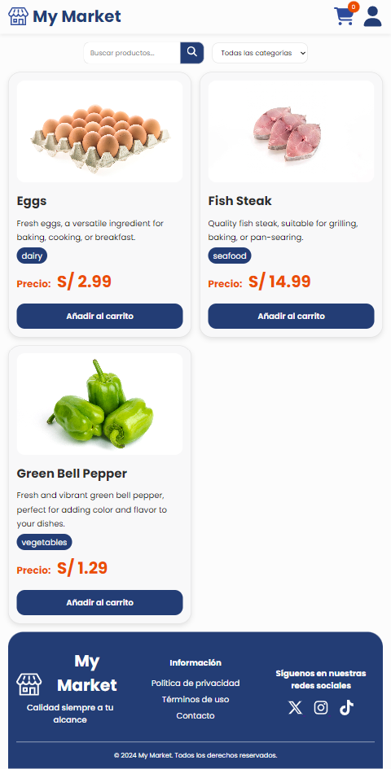
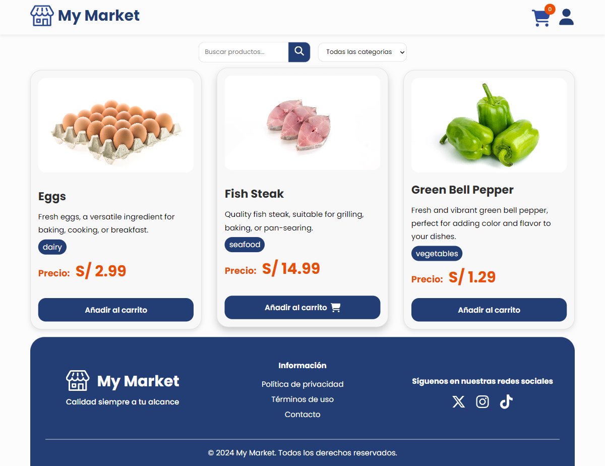

# BOOTCAMP-FRONTEND-REACT-NTT

¡Hola! Este proyecto es un trabajo de diseño y maquetación de un marketplace completamente responsivo, siguiendo el enfoque "mobile-first". Todo esto lo he hecho con HTML5 y CSS3.

## Características:
- **Diseño Mobile-First**: Este proyecto está hecho pensando primero en dispositivos móviles, y luego se adapta a pantallas más grandes como tabletas y laptops.
- **HTML5 & CSS3**: Se utilizó solo HTML5 para la estructura y CSS3 para los estilos.
- **Diseño Responsivo**: Se trabajó con `media queries` para trabajar el diseño y que se adapte automáticamente a diferentes tamaños de pantalla.
- **Estructura de carpetas del proyecto**:
  - `assets/`: Se guardan todas las imágenes e íconos utilizados en el proyecto.
    - `images/`: Dentro de esta carpeta, encontrarás subcarpetas como `logo/` (para el logo) y `products/` (para las imágenes de productos).
    - `icons/`: Donde guardo los íconos utilizados en todo el diseño.
  - `src/`: Aquí están los archivos principales del proyecto:
    - `index.html`: La estructura HTML de todo el sitio.
    - `style.css`: Hoja de estilos personalizados de este proyecto.

## Estructura del Proyecto:
```bash
BOOTCAMP-FRONTEND-REACT-NTT/
├── assets/
│   ├── images/
│   │   ├── logo/
│   │   └── products/
│   └── icon/
├── src/
│   ├── index.html
│   └── style.css
└── README.md
```

## Cómo clonar el proyecto

Para descargar este repositorio, primero clona el repositorio en tu máquina local usando el siguiente comando:

    git clone https://github.com/Sue419/BOOTCAMP-FRONTEND-REACT-NTT.git

- Para ir a la rama feature/diseños-y-estilos, utiliza los siguientes comandos:

1. **Ver las ramas disponibles**:
    git branch -a

2. **Cambiar a la rama feature/diseños-y-estilos**:
```bash
    git branch -a (Para traer todas las ramas del repositorio)
    git checkout feature/diseños-y-estilos / git switch feature/diseños-y-estilos
  ```

¡Y listo! 

## Capturas de Pantalla 
### Vista Móvil


### Vista de Tableta


### Vista de Escritorio

